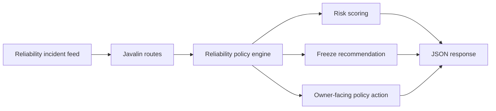

# Reliability Policy Coordinator

Reliability Policy Coordinator is a Kotlin backend for converting dependency drag, error-budget burn, freeze-window pressure, and rollback posture into concrete operating decisions. It is designed as the policy layer between observability signals and the people who need to decide whether a service should freeze, roll back, or stay in watch mode.

## Portfolio Takeaway

This repo broadens the portfolio with a Kotlin JVM backend that feels operational instead of academic. It shows Kotlin in a shape that fits real platform work: request handling, policy scoring, service reliability review, and owner-facing action guidance.

## Overview

| Area | Details |
| --- | --- |
| Language | Kotlin 2.0 |
| Runtime | Java 21 |
| Server | Javalin |
| Focus | Reliability policy, dependency drag, error-budget burn, freeze windows, rollback guidance |
| Routes | `/`, `/docs`, `/api/dashboard/summary`, `/api/incidents`, `/api/incidents/{id}`, `/api/sample`, `/api/analyze/policy` |
| Validation | `./gradlew.bat test` |

## What It Does

- models reliability incidents with severity, dependency drag, freeze-window timing, and rollback posture
- scores each payload into `stable`, `watch`, or `escalate`
- returns an owner lane, policy action, briefing summary, and freeze recommendation
- exposes a simple JSON API that can feed dashboards, runbooks, or internal operations surfaces

## Architecture



Additional detail lives in [C:\Users\chaus\dev\repos\reliability-policy-coordinator\docs\architecture.md](/C:/Users/chaus/dev/repos/reliability-policy-coordinator/docs/architecture.md).

## API

### `GET /`
Returns service metadata and route discovery.

### `GET /docs`
Returns a lightweight HTML operator guide.

### `GET /api/dashboard/summary`
Returns live queue posture and aggregate reliability pressure.

### `GET /api/incidents`
Returns the modeled reliability incidents.

### `GET /api/incidents/{id}`
Returns a single incident thread.

### `GET /api/sample`
Returns a sample policy analysis.

### `POST /api/analyze/policy`
Scores a payload and returns the recommended action.

Example payload:

```json
{
  "id": "rel-7102",
  "title": "Northstar checkout path is burning budget faster than the rollback lane can absorb",
  "service": "checkout-runtime",
  "severity": "critical",
  "sourceLane": "platform",
  "targetLane": "revenue-systems",
  "dependencyDrag": 4,
  "errorBudgetBurn": 0.92,
  "freezeWindowHours": 1.5,
  "rollbackReady": false,
  "confidence": 0.73,
  "blockers": [
    "Cache invalidation handoff is split across two owners",
    "EU traffic lane still routes through the degraded dependency"
  ],
  "nextSteps": [
    "Freeze the release lane and shift traffic to the resilient fallback path",
    "Assign a single rollback owner before the next freeze window closes"
  ]
}
```

## Screenshots

### Hero


### Policy Lanes


### Escalation View


### Validation Proof


## Local Run

```powershell
Set-Location "C:\Users\chaus\dev\repos\reliability-policy-coordinator"
$env:JAVA_HOME = "C:\Program Files\Microsoft\jdk-21.0.11.10-hotspot"
$env:Path = "$env:JAVA_HOME\bin;$env:Path"
.\gradlew.bat run
```

Then open:

- `http://127.0.0.1:4068/`
- `http://127.0.0.1:4068/docs`

## Validation

```powershell
Set-Location "C:\Users\chaus\dev\repos\reliability-policy-coordinator"
$env:JAVA_HOME = "C:\Program Files\Microsoft\jdk-21.0.11.10-hotspot"
$env:Path = "$env:JAVA_HOME\bin;$env:Path"
.\gradlew.bat test
```

## Portfolio Links

- [Kinetic Gain](https://kineticgain.com/)
- [Skills Page](https://mizcausevic.com/skills/)
- [LinkedIn](https://www.linkedin.com/in/mirzacausevic)
- [GitHub](https://github.com/mizcausevic-dev)
