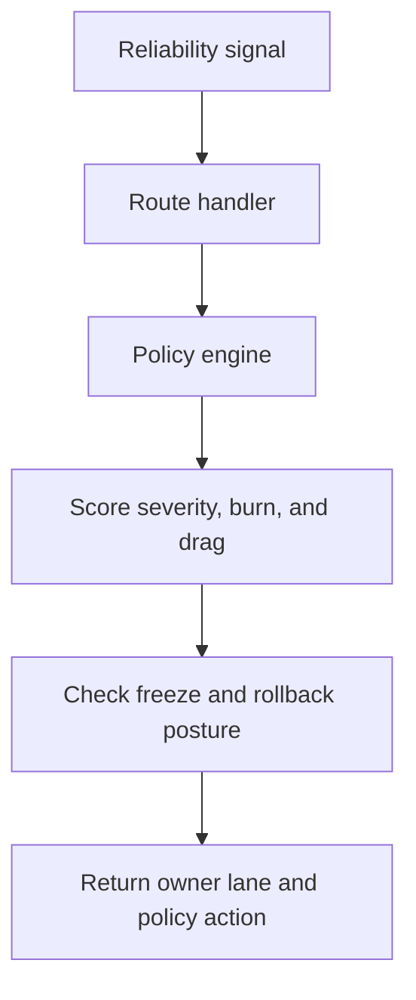

# Architecture

Reliability Policy Coordinator keeps the service shape intentionally small:

- Javalin handles request intake and response formatting
- `ReliabilityPolicyEngine` scores each incident or payload
- `SampleData` provides realistic platform scenarios for validation and README proof
- the output is tuned for operators and leads, not just machine-to-machine responses

## Flow

## Core Inputs

- severity
- dependency drag
- error-budget burn
- freeze-window timing
- rollback readiness
- blocker count
- confidence

## Core Outputs

- status: `stable`, `watch`, or `escalate`
- owner lane
- policy action
- briefing line
- freeze recommendation
